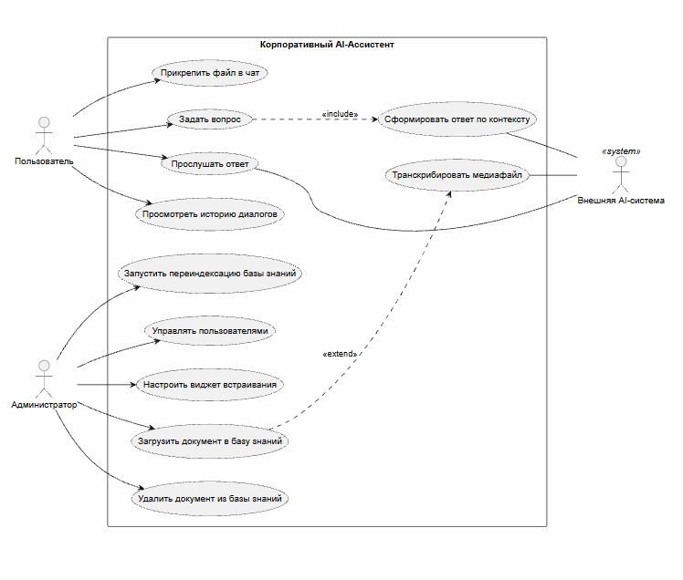

## Диаграмма прецедентов (Use Case Diagram)

### Основные действующие лица (Акторы) и их цели

* **Пользователь (Сотрудник / Клиент):**
* *Цель:* Быстро получать точные ответы на вопросы по базе знаний компании, прослушивать ответы, просматривать историю диалогов и передавать файлы в контекст чата.

* **Администратор базы знаний:**
* *Цель:* Управлять обучающими материалами (загрузка, удаление, переиндексация), следить за статусом обработки файлов, управлять пользователями и настраивать виджет для встраивания.

* **Внешняя AI-система (LLM / Whisper / TTS API):**
* *Цель (технический актор):* Предоставлять сервисы генерации текста, транскрипции аудио/видео и синтеза речи по запросу бэкенда.

### Диаграмма прецедентов

### Пояснение связей между прецедентами

* **`<<include>>` (Обязательное включение):**
* Прецедент `Задать вопрос` обязательно включает в себя `Сформировать ответ по контексту`, так как обработка любого запроса требует поиска по векторной БД и обращения к LLM.

* **`<<extend>>` (Опциональное расширение):**
* Прецедент `Загрузить документ в базу знаний` расширяется прецедентом `Транскрибировать медиафайл` только в том случае, если загружаемый файл является аудио или видеозаписью (MP3, WAV, MP4).