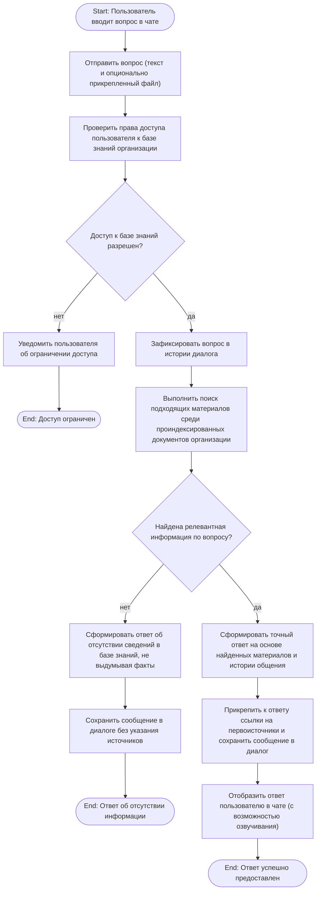
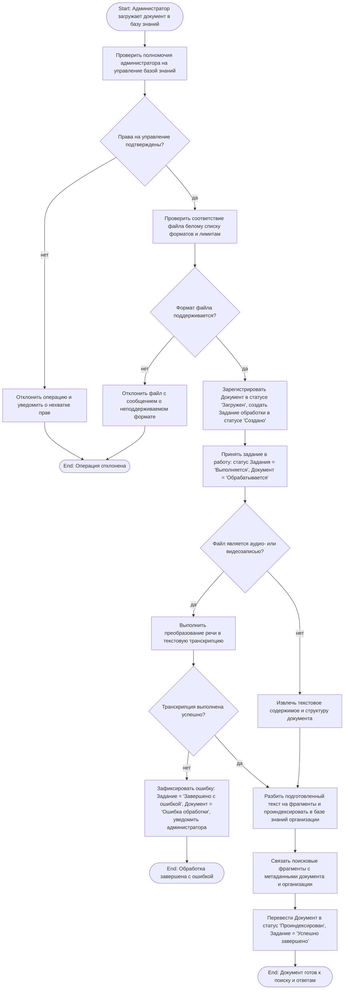
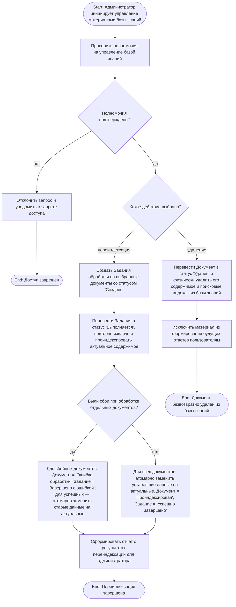

# Задание №3. Диаграммы деятельности (Activity Diagram)

**Автор:** Ваджипов Эмир · ветка `emir` · папка `1-task/3/`
**Основа:** Vision & Scope (`1-task/1/`), UseCase-диаграмма (`1-task/2/`), глоссарий и бизнес-правила (`1-task/4/task.md`)
**Цель шага:** смоделировать сценарии действий пользователей и системы на уровне бизнес-процессов предметной области, выявить правила и ограничения, абстрагируясь от низкоуровневых технических деталей реализации.

## Что сделано

Выбраны 3 ключевых процесса на основе UseCase-диаграммы (`1-task/2/diagram.png`):

1. **Сценарий RAG-ответа на вопрос:** прецедент `Задать вопрос` + обязательное включение `<<include>>` `Сформировать ответ по контексту` (сценарий обращения к знаниям, проверка доступа, поиск материалов, обработка отсутствия информации и выдача ответа с источниками).
2. **Сценарий загрузки и обработки документа (Ingest):** прецедент `Загрузить документ в базу знаний` + опциональное расширение `<<extend>>` `Транскрибировать медиафайл` (сценарий приёма файла, валидация формата, асинхронная транскрипция аудио/видео, индексация и отслеживание статусов).
3. **Сценарий жизненного цикла знаний (Переиндексация и удаление):** прецеденты `Запустить переиндексацию базы знаний` и `Удалить документ из базы знаний` (сценарии актуализации с атомарной заменой данных и физического исключения документов из поиска).

Диаграммы ориентированы на действия участников и реакцию системы (сценарии действий без привязки к конкретным библиотекам, протоколам или форматам внутреннего хранения).

---

## Диаграмма 1. Сценарий ответа на вопрос пользователя (RAG)

Покрывает прецеденты: `Задать вопрос`, `Сформировать ответ по контексту`, `Прикрепить файл в чат`, `Просмотреть историю диалогов`.  
Связанные бизнес-правила: **BR1, BR2, BR3, BR4, BR9, BR10, BR12**.

### Бизнес-логика сценария:
* В поиске участвуют только документы в статусе `Проиндексирован` (материалы на этапах загрузки или обработки к выдаче не допускаются — **BR1, BR4**).
* Проверка принадлежности к организации и прав доступа пользователя выполняется для каждого запроса (**BR2, BR3**).
* Если релевантных материалов недостаточно, система честно сообщает об этом пользователю и запрещает домысливание фактов (**BR9**).
* При успешном ответе обязательно фиксируются ссылки на использованные документы-первоисточники (**BR10**).
* Все реплики сохраняются в истории текущего диалога (**BR12**).

---

## Диаграмма 2. Сценарий загрузки и обработки документа (Ingest и транскрипция)

Покрывает прецеденты: `Загрузить документ в базу знаний`, `Транскрибировать медиафайл`.  
Связанные бизнес-правила: **BR1, BR4, BR5, BR6, BR11, BR15**.

### Бизнес-логика сценария:
* Управление базой знаний доступно исключительно авторизованным администраторам (**BR11**).
* Проверяется поддержка формата по разрешённому перечню (текстовые, табличные, аудио и видеоматериалы — **BR5**).
* Приём файла происходит сразу, а дальнейшая обработка выполняется асинхронно с прозрачной фиксацией состояний: Документ (`Загружен → Обрабатывается → Проиндексирован / Ошибка обработки`) и Задание обработки (`Создано → Выполняется → Успешно завершено / Завершено с ошибкой`) (**BR15**).
* Аудио- и видеоматериалы обязательно проходят процедуру транскрипции перед индексацией (**BR6**).
* До успешного завершения индексации документ не используется при формировании ответов (**BR4**).

---

## Диаграмма 3. Сценарий актуализации и удаления материалов базы знаний

Покрывает прецеденты: `Запустить переиндексацию базы знаний`, `Удалить документ из базы знаний`.  
Связанные бизнес-правила: **BR7, BR8, BR11, BR15**.

### Бизнес-логика сценария:
* Операции переиндексации и удаления доступны только администраторам (**BR11**).
* При переиндексации устаревшие данные документа атомарно заменяются на актуальные, исключая смешивание старой и новой версий (**BR8**). При сбоях на отдельных документах статус ошибки фиксируется изолированно, не ломая успешные документы.
* При удалении документ переводится в статус `Удалён`, его данные физически удаляются из базы знаний и гарантированно не могут использоваться в последующих ответах пользователям (**BR7**).
* Статусы обработки и результаты операций отображаются администратору (**BR15**).

---

## Выявленные правила и ограничения (дополнение к `1-task/4/task.md`)

1. **Регламент поисковой выборки:** В поиске участвуют исключительно документы в статусе `Проиндексирован`, принадлежащие организации пользователя; фильтрация прав и доступности применяется к каждому клиентскому вопросу (**BR1–BR4**).
2. **Контроль достоверности (порог релевантности):** Если найденная информация ниже порога достаточности, система обязательно переходит в ветку «нет информации», запрещая генерацию неподтверждённых корпоративных фактов (**BR9**).
3. **Аудит первоисточников:** Каждый ответ обязан содержать точные указания на использованные документы и смысловые фрагменты (**BR10**) с сохранением всей сессии в истории диалога (**BR12**).
4. **Регламент валидации и обработки:** Приём документов ограничен закрытым белым списком форматов; обработка всегда асинхронна и сопровождается отслеживаемыми статусами сущностей Документ и Задание обработки (**BR5, BR15**).
5. **Обязательная транскрипция мультимедиа:** Аудио- и видеофайлы не допускаются к поиску без успешного перевода речи в текстовую транскрипцию (**BR6**).
6. **Целостность базы знаний:** Обновление материалов требует атомарной замены данных без риска пересечения версий (**BR8**); удаление требует полного физического уничтожения поисковых индексов документа (**BR7**).

---

## Трассируемость

| Процесс (Activity) | Прецеденты Use Case (`1-task/2/diagram.png`) | Границы системы (`1-task/1/Readme.md`) | Бизнес-правила (`1-task/4/task.md`) |
|---|---|---|---|
| **Диаграмма 1 (RAG-ответ)** | `Задать вопрос` + `<<include>>` `Сформировать ответ по контексту`, `Прикрепить файл в чат`, `Просмотреть историю диалогов` | Чат, стриминг, история диалогов, RAG | BR1, BR2, BR3, BR4, BR9, BR10, BR12 |
| **Диаграмма 2 (Ingest)** | `Загрузить документ в базу знаний` + `<<extend>>` `Транскрибировать медиафайл` | Drag & drop загрузка, автотранскрипция, статусы обработки | BR1, BR4, BR5, BR6, BR11, BR15 |
| **Диаграмма 3 (Reindex / Delete)** | `Запустить переиндексацию базы знаний`, `Удалить документ из базы знаний` | Панель управления, удаление, переиндексация | BR7, BR8, BR11, BR15 |

---

## Формат и нотация

* Все диаграммы построены на Mermaid `flowchart` и визуализируются непосредственно средствами GitHub Markdown.
* Нотация: `(["..."])` — скруглённый стартовый и конечный узел процесса, `[...]` — действие пользователя или реакция системы, `{...}` — проверка условий и ветвление решений, `|условие|` — маркер перехода.
