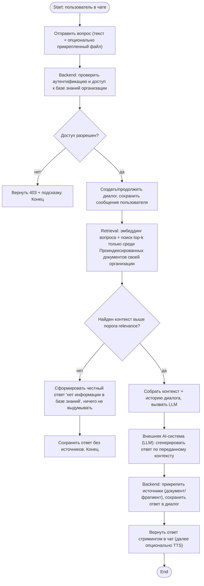
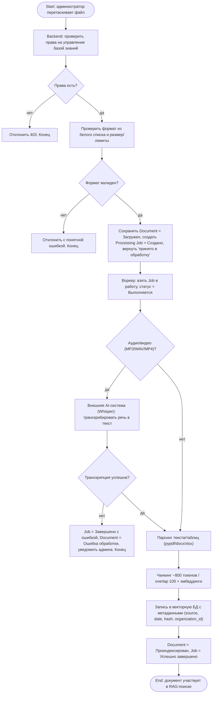
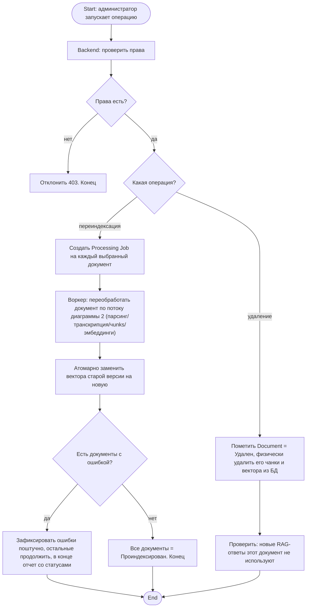

# Задание №3. Диаграммы деятельности (Activity Diagram)

**Автор:** Ваджипов Эмир · ветка `emir` · папка `1-task/3/`
**Основа:** Vision & Scope (`1-task/1/`), UseCase-диаграмма (`1-task/2/`), глоссарий и бизнес-правила (`1-task/4/task.md`)
**Цель шага:** выявить правила и ограничения, описать процессы предметной области, в контексте которой будет внедряться система. Критично для корректности требований к системе.

## Что сделано

Выбраны 3 сложных прецедента из UseCase-диаграммы (см. `../2/diagram.png`):

1. **UC «Задать вопрос» + `<<include>>` «Сформировать ответ по контексту» (RAG-цикл)** — самый сложный: ретривал, контроль доступа, генерация, случай «нет информации».
2. **UC «Загрузить документ в базу знаний» + `<<extend>>` «Транскрибировать медиафайл» (ingest-пайплайн)** — валидация, асинхронная обработка, транскрипция, индексация, статусы и ошибки.
3. **UC «Запустить переиндексацию базы знаний» + «Удалить документ из базы знаний» (жизненный цикл знаний)** — обновление и удаление, атомарная замена векторов.

Для каждого построена Activity Diagram (Mermaid, рендерится на GitHub). Дорожки = участники: Пользователь / Администратор / Backend / Retrieval + Векторная БД / Внешняя AI-система (LLM, Whisper, TTS).

## Диаграмма 1. RAG-ответ на вопрос пользователя

Покрывает: `Задать вопрос`, `Сформировать ответ по контексту`, частично `Прикрепить файл в чат`, `Просмотреть историю диалогов`. Связь с правилами BR1, BR2, BR3, BR9, BR10, BR12.

Ключевое: документы со статусами `Загружен / Обрабатывается / Ошибка` в поиске не участвуют — только `Проиндексирован` (BR1, BR4). Фильтр `organization_id + access` применяется на каждый запрос (BR2, BR3). Пустой результат — не ошибка, а штатная ветка «нет информации» (BR9). У каждого ответа — список источников (BR10), диалог сохраняется (BR12).

## Диаграмма 2. Загрузка документа в базу знаний (ingest)

Покрывает: `Загрузить документ в базу знаний`, `Транскрибировать медиафайл`. Связь с BR1, BR4, BR5, BR6, BR11, BR15 + ограничение форматов из Vision (TXT, MD, PDF, DOCX, XLSX, MP3, WAV, MP4).

Ключевое: приём файла — синхронный и быстрый, обработка — асинхронная со статусами (BR15). До `Проиндексирован` документ в ответах не используется (BR4). Аудио/видео без транскрипции в базу не попадает (BR6, BR5).

## Диаграмма 3. Переиндексация и удаление (поддержание знаний в актуальности)

Покрывает: `Запустить переиндексацию базы знаний`, `Удалить документ из базы знаний`. Связь с BR7, BR8, BR11, BR15.

Ключевое: обновление — с заменой, а не дописыванием (иначе в ответах смешаются старая и новая версии — BR8). Удаление — с физическим удалением векторов, иначе «удаленный» документ продолжит всплывать в поиске (BR7).

## Выявленные правила и ограничения (дополнение к `1-task/4/task.md`)

1. В RAG-поиске участвуют только документы `Проиндексирован` своей организации + фильтр прав (ужесточение BR1–BR3: фильтр на каждый запрос, а не только на входе).
2. Порог relevance обязателен: ниже порога — ветка «нет информации», запрет выдумывать корпоративные факты (BR9).
3. Каждый ответ хранит источники (doc id + chunk id) для аудита (BR10) и сохраняется в диалог (BR12).
4. Ingest только из белого списка форматов; приём — синхронно, обработка — асинхронно со статусами `Создано → Выполняется → Успешно / Ошибка` (BR15, BR4).
5. Медиафайлы проходят обязательную транскрипцию до индексации (BR6); метаданные (source, date, hash, org) пишутся вместе с векторами (трассируемость, база для переиндексации).
6. Переиндексация — атомарная замена версии документа (BR8); удаление — физическое удаление векторов (BR7); обе операции только с правами управления БЗ (BR11).
7. Ограничения из Vision, подтвержденные моделированием: без интеграции ERP/CRM, без обучения LLM с нуля, только транскрипция (без дубляжа/перевода видео), нужен интернет + API-ключи для LLM/Whisper/TTS; качество ответов = f(полнота и корректность БЗ).

## Трассируемость

| Activity | UseCase (`1-task/2`) | Vision (`1-task/1`) | Правила (`1-task/4`) |
|---|---|---|---|
| Диаграмма 1 (RAG-ответ) | Задать вопрос + include Сформировать ответ | Чат, стриминг, история, RAG | BR1, BR2, BR3, BR9, BR10, BR12 |
| Диаграмма 2 (ingest) | Загрузить документ + extend Транскрипция | drag&drop, Whisper, эмбеддинги, статусы | BR1, BR4, BR5, BR6, BR11, BR15 |
| Диаграмма 3 (reindex/delete) | Переиндексация, Удаление документа | Админ-панель, удаление | BR7, BR8, BR11, BR15 |

## Формат и как смотреть

* Все диаграммы — Mermaid `flowchart` в этом README, рендерятся прямо на GitHub, отдельный рендер не нужен.
* Исходники vision / usecase / глоссария: `../1/Readme.md`, `../2/Readme.md` + `../2/diagram.png`, `../4/task.md`.
* Нотация: скругленный стартовый/конечный узел, `[...]` — действие, `{...}` — решение/ветвление, `|да/нет|` — условия на ребрах.
